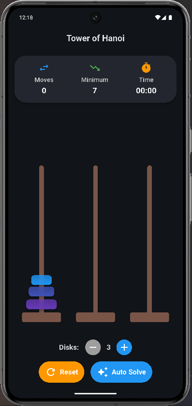
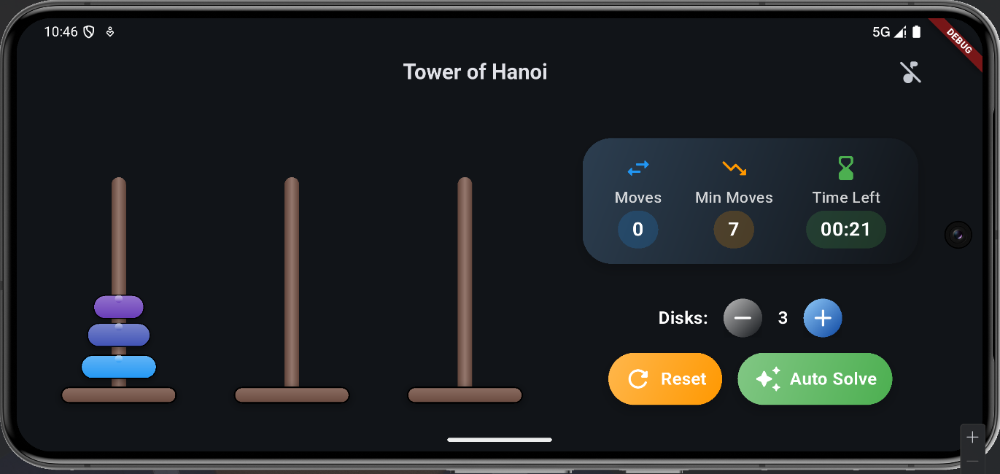

# 🎉 Tower of Hanoi

Welcome to the **Tower of Hanoi Flutter App**! This is an exciting, interactive implementation of
the classic Tower of Hanoi puzzle game, built with Flutter. Whether you're a puzzle enthusiast or a
casual gamer, this app offers a delightful experience with smooth gameplay, stunning visuals, and
handy features like auto-solving and audio feedback.

---

## 🚀 What is the Tower of Hanoi?

The Tower of Hanoi is a timeless mathematical puzzle featuring **three towers** and a stack of disks
of varying sizes. The goal? Move the entire stack from the first tower to another, following these
rules:

- **One Disk at a Time:** Only the top disk can be moved.
- **Legal Moves Only:** A larger disk cannot be placed on top of a smaller one.
- **Strategic Thinking:** Plan your moves to win!

This app brings the puzzle to life with a modern twist, making it both fun and educational.

---

## ✨ Features

- **Interactive Gameplay:** Tap towers to select and move disks with ease.
- **Auto-Solve Magic:** Watch the app solve the puzzle step-by-step.
- **Custom Difficulty:** Adjust the number of disks (1–7) to challenge yourself.
- **Performance Tracking:** Monitor your time and moves with a built-in timer and counter.
- **Victory Celebration:** Get notified with a win dialog when you solve the puzzle!
- **Immersive Audio:** Enjoy background music and sound effects for every action.

---

## 📥 Installation

Get started in just a few steps!

1. **Set Up Flutter:** Ensure you have Flutter installed. New to Flutter? Follow
   the [official Flutter installation guide](https://flutter.dev/docs/get-started/install).
2. **Clone the Repo:** `git clone https://github.com/Mopheshi/TowerOfHanoi.git`
3. **Navigate to Directory:** `cd TowerOfHanoi`
4. **Install Dependencies:** Run `flutter pub get`
5. **Launch the App:** Run `flutter run` to play on your device or emulator.

> **Pro Tip:** Make sure a device or emulator is connected before running!

---

## 🎮 How to Play

Ready to conquer the towers? Here’s how:

1. **Start:** All disks begin stacked on the first tower, smallest on top.
2. **Select:** Tap a tower to pick its top disk (if any).
3. **Move:** Tap another tower to place the disk, following the rules.
4. **Win:** Move all disks to the second or third tower to claim victory!
5. **Auto-Solve:** Hit the "Auto Solve" button to see the solution in action.
6. **Reset:** Tap "Reset" to restart with the same disk count.
7. **Adjust Difficulty:** Use "+" and "-" buttons to change the number of disks.

---

## 🖼️ Screenshots

See the app in action!

  
*Interactive gameplay in portrait mode*

  
*Interactive gameplay in landscape mode*

  
*Celebrate your victory!*

  
*Celebrate your victory!*

---

## 🛠️ Technologies Used

This app is powered by cutting-edge tools:

- **Flutter:** Cross-platform UI framework for a seamless experience.
- **Dart:** The language behind the app’s logic and interactivity.
- **Riverpod:** State management for smooth, reactive updates.
- **GoogleFonts:** Beautiful typography for a polished look.
- **JustAudio:** Adds background music and sound effects.
- **AudioSession:** Manages audio sessions for a polished experience.
- **SharedPreferences:** Stores user preferences for a personalized touch.

---

## 💡 Development Highlights

- **Recursive Auto-Solve:** Uses a classic recursive algorithm to solve the puzzle efficiently.
- **Dynamic Disks:** Disks vary in size and color for clear visuals.
- **Responsive Design:** Adapts beautifully to portrait and landscape modes.
- **Audio Experience:** Sound effects enhance every move, selection, and win.

---

## 🤝 Contributing

Love the app? Want to make it even better? We welcome contributions!

- **Report Issues:** Spot a bug? Open an issue on GitHub.
- **Submit Pull Requests:** Have an improvement? Fork the repo and send us your changes.

---

## 📜 License

This project is licensed under the **MIT License**. See the [LICENSE](LICENSE) file for details.

---

## 🌟 Get Started!

Clone the repo, run the app, and dive into the world of Tower of Hanoi. Whether you’re solving it
yourself or watching the auto-solve in awe, this Flutter app promises hours of fun and learning.
Happy puzzling!
